# About me
- 👋 Hi, I’m Alex Boa Morte (@goodeath)
- 🗣️ I speak Portuguese (Native) and English. I'm currently learning Japanese🇯🇵
- 🏋️‍♂️ Trying new challenges

# Main Projects

 

  <a href="https://github.com/goodeath">
  
  

<!---
- 👀 I’m interested in ...
- 🌱 I’m currently learning ...
- 💞️ I’m looking to collaborate on ...
- 📫 How to reach me ...
goodeath/goodeath is a ✨ special ✨ repository because its `README.md` (this file) appears on your GitHub profile.
You can click the Preview link to take a look at your changes.
--->
